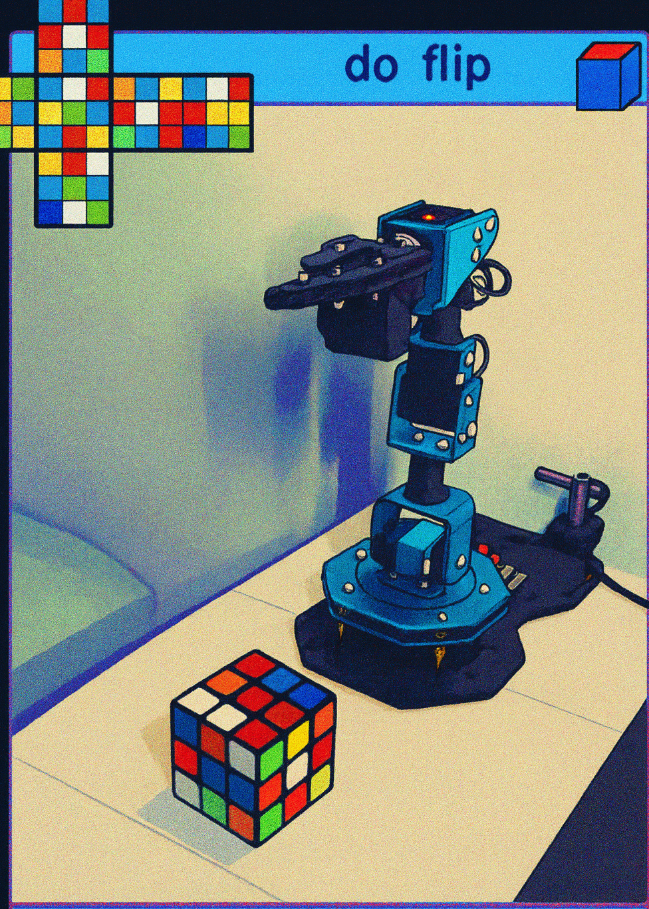

  # xArm Cuber



Python project for controlling a HiWonder xArm to manipulate and solve a Rubik's Cube. Includes motion control, camera integration, and cube-solving policy execution.

<h3>Features</h3>

- **Dual-process architecture**: Concurrent vision analysis and robot execution
- **Computer vision**: Real-time cube detection, color classification, and state tracking  with rubicvision
- **Learned policies**: SmolVLA or ACT
- **Real-time visualization**: Rerun integration for live monitoring and debugging

<h3>Installation</h3>
```bash
# Clone with submodules
git clone --recursive https://github.com/yourusername/xarm-cuber.git
cd xarm-cuber

# Setup Python environment
conda create -n cube python=3.10
conda activate cube

# Install dependencies  
pip install -e thirdparty/lerobot/src
pip install -e thirdparty/rubikvision
```

<h3>Running the Solver</h3>
```bash
# Run autonomous solver
python src/main.py \
--robot.cameras="$CAMERAS_CONFIG" \
--robot.type=xarm_follower \
--robot.port=/dev/ttyUSB0 \
--policy.path="$POLICY_PATH" \
--dataset.repo_id="$REPO_ID" \
--dataset.single_task="task" \
--display_data=true \
--resume=true \
--policy.chunk_size=20 \
--policy.n_action_steps=20
```

<h3>Architecture</h3>

```
┌──────────────────┐                     ┌──────────────────┐
│   Robot &        │◄──── action ──────► │   Vision &       │
│   Camera         │                     │   Planning       │
│   Process        │──── image/busy ───► │   Process        │
│                  │                     │                  │
│ - Camera capture │                     │ - Cube detection │
│ - Policy control │                     │ - State analysis │
│ - Action chunking│                     │ - Solve planning │
│ - Robot commands │                     │ - Action mapping │
│ - Task execution │                     │ - Kociemba solve │
│ - Rerun logging  │                     │ - Rerun logging  │
└──────────────────┘                     └──────────────────┘

Flow: Camera → Vision Analysis → Action Planning → Robot Execution → Repeat
Communication: PyTorch shared memory (image, busy flag, action commands)
```

<h3>Training Your Own Policies</h3>

```bash
# Record demonstrations
bash scripts/record_demo.sh

# Train ACT policy
bash scripts/train_act.sh
```

<h3>Acknowledgments</h3>

- [LeRobot](https://github.com/huggingface/lerobot) for the robotics framework
- Kociemba algorithm for optimal cube solving sequences